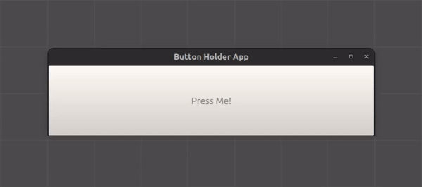
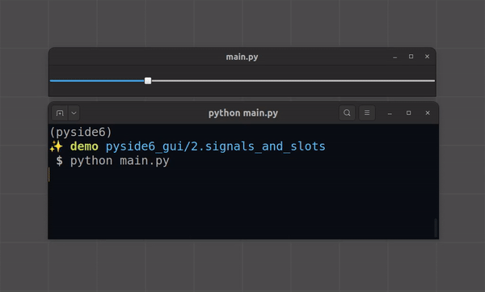

# pyside6Practice
Practice building Graphical User Interfaces (GUIs) with Python, using PySide6.
\
\
This repo is a result of following the [5-hour freeCodeCamp YouTube tutorial](https://www.youtube.com/watch?v=Z1N9JzNax2k),
\
"Learn Python GUI Development for Desktop – PySide6 and Qt Tutorial".
# Demos
## Basic button

## Signals and Slots

